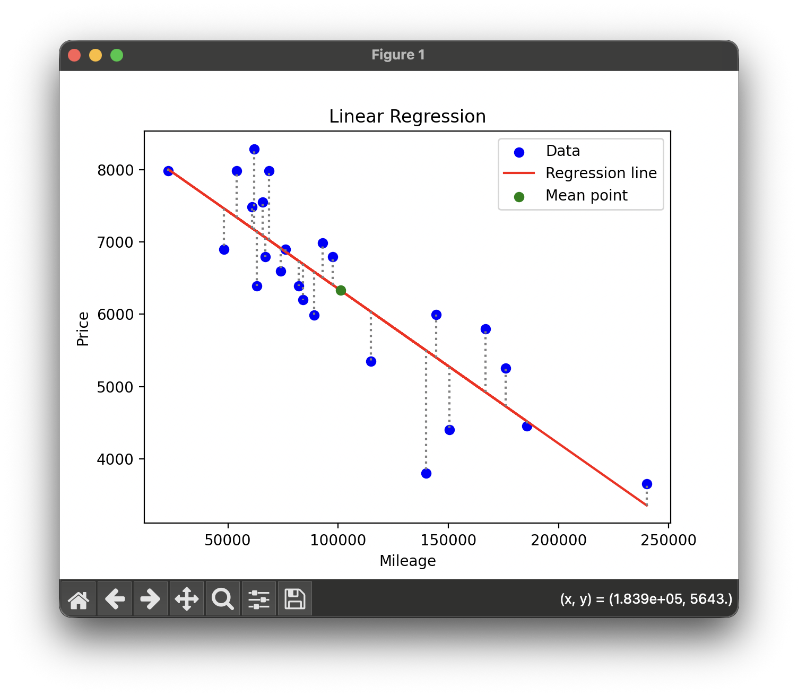

# Ft_linear_regression

> Introduction to Machine Learning: car price prediction using linear regression

[](https://github.com/Cimeci)

---

## Table of Contents

- [About](#-about)
- [Features](#-features)
- [Prerequisites](#-prerequisites)
- [Installation](#-installation)
- [Usage](#-usage)
- [How it Works](#-how-it-works)
- [Project Structure](#-project-structure)
- [Author](#-author)

---

## About

This project represents my first steps into artificial intelligence and more specifically Machine Learning. It implements a **linear regression** algorithm using **gradient descent** to predict a car's price based on its mileage.

### Learning Objectives

- Understand the fundamentals of linear regression
- Implement the gradient descent algorithm
- Master data normalization
- Visualize results and model convergence

---

## Features

- **Data reading and processing** from a CSV file
- **Model training** with gradient descent algorithm
- **Price prediction** for a car based on its mileage
- **Graphical visualization**:
  - Regression line on data
  - Cost function evolution
  - Residuals analysis
- **Parameters saving** (theta0, theta1) for reuse

---

## Prerequisites

- Python 3.6 or higher
- pip (Python package manager)

---

## Installation

1. Clone the repository:

```bash
git clone https://github.com/Cimeci/Ft_linear_regression.git
cd Ft_linear_regression
```

2. Install dependencies:

```bash
pip install pandas matplotlib
```

3. Run the main script:

```bash
python3 ft_linear_regression.py
```

```bash
================================
|   Linear Regression Model     |
================================
1. Train the model
2. Predict price
3. Visualize training results
4. Calculate precision
5. Clean data
6. More info
7. Clean terminal
0. Exit
```

---

## Usage

### 1. Train the Model

Run the training on data from the `data.csv` file:

This command will:
- Load the data
- Normalize the features (mileage)
- Train the model using gradient descent
- Display visualization graphs
- Save the parameters (theta0, theta1) in `theta.csv`

### 2. Predict a Price

Once the model is trained, use it to predict a car's price:

The application will ask you to enter a mileage and will give you the estimated price.

**Example:**
```
Enter the mileage: 50000
Estimated price: 7234.56
```

### 3. Visualize Results

Display graphs of the regression line, cost function, and residuals to analyze model performance.



### 4. Calculate Precision

Display the model's precision based on average residuals and residual standard deviation.

```bash
Model precision: 73.30%
```

---

## How it Works

### Linear Regression

The model seeks to find the best line $y = \theta_0 + \theta_1 \cdot x$ where:
- $x$: mileage (feature)
- $y$: estimated price (target)
- $\theta_0$: y-intercept (intercept)
- $\theta_1$: slope (coefficient)

### Gradient Descent

**The Gradient Descent algorithm iteratively updates parameters to minimize the cost function $J(\theta)$**

#### Normalization

To improve convergence, data is normalized:

$$x_{norm} = \frac{x - \mu}{\sigma}$$

| Symbol | Description |
| --- | --- |
| $\mu$ | moyenne |
| $\sigma$ | écart-type |

EstimatePrice Function :
```python
self.estimate = self.theta0 + self.theta1 * self.km_norm
```

Function result used to calculate the error vector (residuals) :
```python
error = self.estimate - self.price
```

and the error vector is used to calculate the partial derivatives of the cost function with respect to $\theta_0$ and $\theta_1$.


*To get tmp_$\theta_0$ for update $\theta_0$ :*

Mathematical formula :

$$\frac{\partial J}{\partial \theta_0} = \frac{1}{m} \sum (h_\theta(x^{(i)}) - y^{(i)})$$

Subject Formule :

$$tmp_\theta0 = learningRate ∗ \frac{1}{m} \sum_{i=0}^{m-1} (estimatePrice(mileage[i]) − price[i])$$

code:
```python
tmp_theta0 = self.learning_rate * (1/self.m) * error.sum()
```

update $\theta_0$ :

$$\theta_0 := \theta_0 - \alpha \frac{\partial J}{\partial \theta_0}$$


*To get tmp_$\theta_1$ for update $\theta_1$ :*

Mathematical formula :

$$\frac{\partial J}{\partial \theta_1} = \frac{1}{m} \sum (h_\theta(x^{(i)}) - y^{(i)}) x^{(i)}$$

Subject Formule :

$$tmp_\theta1 = learningRate ∗ \frac{1}{m} \sum_{i=0}^{m-1} (estimatePrice(mileage[i]) − price[i]) * mileage[i]$$

code:
```python
tmp_theta1 = self.learning_rate * (1/self.m) * (error * self.km_norm).sum()
```

update $\theta_0$ :

$$\theta_1 := \theta_1 - \alpha \frac{\partial J}{\partial \theta_1}$$

#### Denormalization

To use the model for prediction, we need to denormalize the parameters:

$$\boxed{\theta_1^{real} = \frac{\theta_1}{\sigma}}$$

$$\boxed{\theta_0^{real} = \theta_0 - \theta_1^{real} \cdot \mu}$$

---

## Project Structure

```
Ft_linear_regression/
│
├── data.csv                    # Training data (km, price)
├── theta.csv                   # Saved parameters after training
├── train.py                    # Model training script
├── predict.py                  # Prediction script
├── ft_linear_regression.py     # Main module (if applicable)
└── README.md                   # Documentation
```

---

## Sources

[linear regression explanation](https://www.w3schools.com/python/python_ml_linear_regression.asp)
[gradient descent explanation 1](https://www.geeksforgeeks.org/machine-learning/gradient-descent-in-linear-regression/)
[gradient descent explanation 2](https://www.analyticsvidhya.com/blog/2021/04/gradient-descent-in-linear-regression/)
[matplotlib documentation](https://matplotlib.org/stable/api/)
[pandas documentation](https://egallic.fr/Enseignement/Python/pandas.html)

---

## Author

**Cimeci**

- GitHub: [@Cimeci](https://github.com/Cimeci)